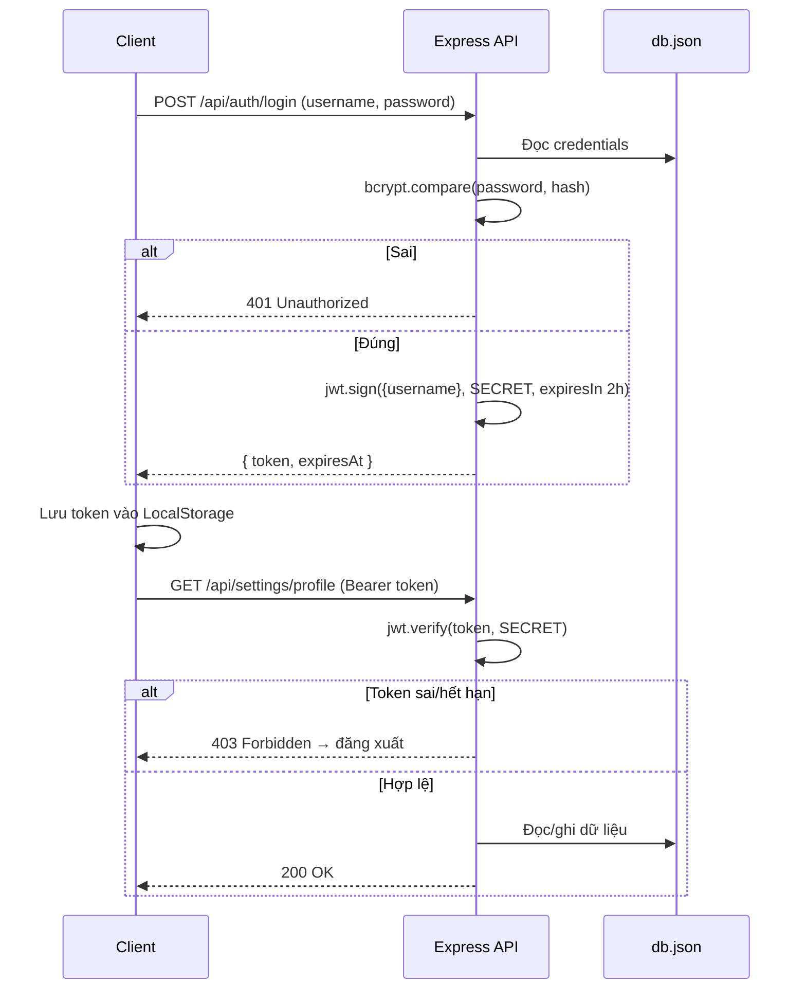

# 03 — Dev Rules · Quy tắc Lập trình

> Quy ước kỹ thuật cho frontend (React) và backend (Express). Mục tiêu: code dễ đọc, an toàn, và **khớp 1-1 với SRS** ([01-srs.md](01-srs.md)) + **Design Rules** ([02-design-rules.md](02-design-rules.md)).

---

## 1. Cấu trúc thư mục

> **FE và BE tách riêng hoàn toàn thành 2 thư mục** — mỗi bên có `package.json` riêng, chạy & deploy độc lập. `wiki/` là tài liệu dùng chung ở gốc.

```
Proto/
├── wiki/                      # ★ Tài liệu chuẩn dùng chung (file này)
├── README.md                  # Hướng dẫn nhanh
│
├── frontend/                  # ── FRONTEND (React + Vite) ──
│   ├── index.html             # SEO, Google Fonts, root mount
│   ├── vite.config.js         # Vite + proxy /api → http://localhost:5001
│   ├── package.json           # Thư viện FE (react, lucide-react, vite)
│   └── src/
│       ├── main.jsx           # Điểm khởi chạy React
│       ├── App.jsx            # Điều hướng (portfolio/login/admin) + lưu JWT
│       ├── index.css          # ★ Design tokens + component + responsive ladder
│       └── components/
│           ├── BackgroundEffect.jsx  # Canvas particles + spotlight
│           ├── Portfolio.jsx         # Trang public
│           ├── Login.jsx             # Đăng nhập JWT
│           └── Admin.jsx             # Bảng quản trị + log JWT
│
└── backend/                   # ── BACKEND (Node + Express) ──
    ├── package.json           # Thư viện BE (express, jsonwebtoken, bcryptjs)
    ├── server.js              # REST API + middleware JWT
    └── db.json                # Lưu trữ profile + projects + credentials
```

**Ranh giới FE ↔ BE:** hai bên chỉ giao tiếp qua REST API. Khi dev, Vite proxy `/api` sang `http://localhost:5001` (cấu hình trong `frontend/vite.config.js`) nên không lo CORS/đường dẫn.

---

## 2. Quy ước Frontend (React)

1. **Component PascalCase**, một component / file. Helper trình bày nhỏ (vd `Metric`, `ContactLine`) có thể nằm cùng file cha.
2. **State tối thiểu** — chỉ giữ state thực sự cần render. Dữ liệu suy ra được thì dùng `useMemo` (vd `initials`, `skillGroups` trong [`Portfolio.jsx`](../frontend/src/components/Portfolio.jsx)).
3. **Không hardcode giá trị thị giác** — dùng class + token CSS từ Design Rules. Inline style chỉ cho giá trị động (vd màu metric truyền qua prop).
4. **Dữ liệu luôn có fallback** — `App.jsx` giữ `fallbackData` để portfolio vẫn chạy khi API offline. Khi đổi schema `db.json`, **đồng bộ luôn** `fallbackData`.
5. **Truy cập an toàn** — dùng optional chaining (`profile.education?.school`) và `Array.isArray()` trước khi `.map()`.
6. **Accessibility** — input có `<label htmlFor>`, link ngoài có `rel="noreferrer"`, ảnh/effect trang trí có `aria-hidden`.

### Naming
- Class CSS: `kebab-case`, theo block-element (vd `.timeline-item`, `.timeline-head`, `.timeline-points`).
- Biến/hàm JS: `camelCase`. Hằng: `UPPER_SNAKE` nếu là cấu hình.

---

## 3. Quy ước Backend (Express) — `backend/server.js`

1. **Phân tách rõ public vs secure** — route sửa dữ liệu **bắt buộc** qua middleware `authenticateJWT`.
2. **Không bao giờ trả `credentials`** ra client — `GET /api/settings` loại bỏ trường này.
3. **Không lưu mật khẩu plain-text** — `initDatabase()` tự hash bằng bcrypt khi phát hiện chuỗi chưa hash.
4. **Merge an toàn khi update profile** — `{ ...db.profile, ...newProfile }` để không xoá trường không gửi lên.
5. **Validate input** — `projects` phải là array; login phải đủ `username` + `password`; đổi mật khẩu phải khớp mật khẩu cũ.
6. **Mã trạng thái HTTP đúng nghĩa** — 400 (thiếu dữ liệu), 401 (chưa xác thực), 403 (token sai/hết hạn), 500 (lỗi ghi file).
7. **Body limit** — `express.json({ limit: '5mb' })` để chứa ảnh avatar base64 (`profile.avatar`). Ảnh đã được nén về 320px ở client trước khi gửi để giữ `db.json` nhẹ.

---

## 4. Đặc tả API đầy đủ

| Method | Đường dẫn | Quyền | Request Body | Phản hồi |
| :-- | :-- | :-- | :-- | :-- |
| GET | `/api/settings` | Công khai | – | `{ profile, projects }` |
| POST | `/api/auth/login` | Công khai | `{ username, password }` | `{ token, expiresAt, user }` / 401 |
| GET | `/api/auth/verify` | JWT | – | `{ valid, user }` / 403 |
| POST | `/api/settings/profile` | JWT | object `profile` | `{ success, profile }` |
| POST | `/api/settings/projects` | JWT | array `projects` | `{ success, projects }` |
| POST | `/api/settings/change-password` | JWT | `{ currentPassword, newPassword }` | `{ success }` / 400 |

---

## 5. Bảo mật JWT (NFR-01)



- Thuật toán ký: **HMAC SHA256**. Hết hạn: **2h** (`expiresIn: '2h'`).
- `JWT_SECRET` đọc từ biến môi trường — **không** commit secret thật lên repo công khai.
- FE kiểm tra `expiresAt` theo giây và tự đăng xuất (FR-09).

---

## 6. Hiệu năng (NFR-02)
- Canvas particles dùng `requestAnimationFrame`, huỷ đúng cách khi unmount.
- Spotlight theo con trỏ cập nhật qua biến CSS `--mouse-x/--mouse-y` (một event listener) — tránh re-render React.

---

## 7. Chạy & build

Mở **2 cửa sổ terminal** — chạy backend trước, rồi tới frontend:

```bash
# Terminal 1 — BACKEND
cd backend && npm install && npm start      # http://localhost:5001

# Terminal 2 — FRONTEND
cd frontend && npm install && npm run dev    # http://localhost:5173
cd frontend && npm run build                 # đóng gói production
cd frontend && npm run lint                  # kiểm tra eslint
```

---

## 8. Git & quy ước commit (khuyến nghị)
- Branch theo loại việc: `feat/…`, `fix/…`, `docs/…`, `design/…`.
- Commit ngắn gọn, thì hiện tại: `feat: add experience timeline section`.
- **PR phải nêu** FR/NFR liên quan và checklist Design Rules đã đạt (mục 8 của file 02).

---

## 9. Definition of Done
Một thay đổi được coi là *xong* khi: (1) đáp ứng đúng FR/NFR; (2) qua checklist Design Rules; (3) `npm run build` thành công; (4) responsive 320–1440px; (5) cập nhật wiki nếu đổi hành vi/đặc tả.
