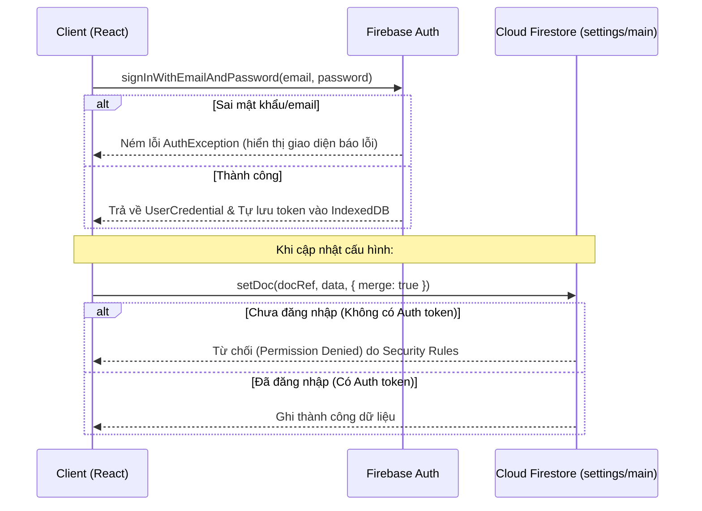

# 03 — Dev Rules · Quy tắc Lập trình

> Quy ước kỹ thuật cho frontend (React) sử dụng tích hợp trực tiếp các dịch vụ không máy chủ của Firebase (Auth và Cloud Firestore). Mục tiêu: code dễ đọc, an toàn, và **khớp 1-1 với SRS** ([01-srs.md](01-srs.md)) + **Design Rules** ([02-design-rules.md](02-design-rules.md)).

---

## 1. Cấu trúc thư mục

> Dự án đã chuyển dịch hoàn toàn sang kiến trúc **Serverless** (Không máy chủ). Toàn bộ logic lưu trữ dữ liệu và xác thực được xử lý trực tiếp từ phía Client thông qua Firebase SDK. Thư mục `backend/` cũ chỉ dùng để đối chiếu tham khảo.

```
Proto/
├── wiki/                      # ★ Tài liệu chuẩn dùng chung (file này)
├── README.md                  # Hướng dẫn nhanh
│
└── frontend/                  # ── FRONTEND (React + Vite + Firebase) ──
    ├── firebase.json          # Cấu hình Firebase Hosting
    ├── .firebaserc            # Project mapping của Firebase
    ├── index.html             # SEO, Google Fonts, root mount
    ├── vite.config.js         # Vite configuration (Vite v5 tương thích Node 18)
    ├── package.json           # Thư viện FE & Firebase Client SDK
    └── src/
        ├── main.jsx           # Điểm khởi chạy React
        ├── firebase.js        # ★ Khởi tạo Firebase App, Auth & Firestore
        ├── db-init.js         # Script đồng bộ dữ liệu local lên Cloud Firestore
        ├── App.jsx            # Điều hướng chính & Lắng nghe trạng thái Auth
        ├── index.css          # ★ Design tokens + component + responsive ladder
        └── components/
            ├── BackgroundEffect.jsx  # Canvas particles + spotlight
            ├── Portfolio.jsx         # Trang public
            ├── Login.jsx             # Đăng nhập bằng Firebase Auth SDK
            └── Admin.jsx             # Bảng quản trị cập nhật dữ liệu Firestore
```

---

## 2. Quy ước Frontend (React & Firebase)

1. **Component PascalCase**, một component / file. Helper trình bày nhỏ (vd `Metric`, `ContactLine`) có thể nằm cùng file cha.
2. **State tối thiểu** — chỉ giữ state thực sự cần render. Dữ liệu suy ra được thì dùng `useMemo` (vd `initials`, `skillGroups` trong [`Portfolio.jsx`](../frontend/src/components/Portfolio.jsx)).
3. **Không hardcode giá trị thị giác** — dùng class + token CSS từ Design Rules. Inline style chỉ cho giá trị động (vd màu metric truyền qua prop).
4. **Dữ liệu luôn có fallback** — `App.jsx` giữ `fallbackData` để portfolio vẫn hiển thị bình thường khi kết nối Firestore offline/lỗi.
5. **Truy cập an toàn** — dùng optional chaining (`profile.education?.school`) và `Array.isArray()` trước khi `.map()`.
6. **Bảo mật và Quyền hạn**:
   - Sử dụng các hooks/hàm của Firebase Auth (`onAuthStateChanged`) để cập nhật trạng thái đăng nhập.
   - Không được thực hiện ghi trực tiếp lên Firestore nếu không kiểm tra `auth.currentUser`.

---

## 3. Quy tắc Bảo mật Cloud Firestore (Security Rules)

Mọi thao tác ghi dữ liệu từ Client lên Firestore đều được giám sát bởi Quy tắc Bảo mật (Security Rules). Quy tắc cấu hình tại Firebase Console đối với Collection `settings/main` như sau:

```javascript
rules_version = '2';
service cloud.firestore {
  match /databases/{database}/documents {
    match /settings/main {
      allow read: if true;                     // Mọi khách truy cập đều có thể xem portfolio
      allow write: if request.auth != null;    // Chỉ quản trị viên đã đăng nhập mới được lưu chỉnh sửa
    }
  }
}
```

---

## 4. Luồng xử lý Xác thực & Ghi dữ liệu


